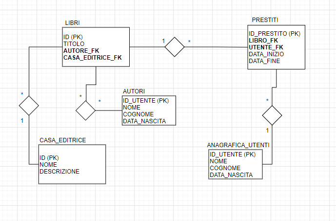

**BOOLEAN**: *db-hotel* exercise
================================
Let's create a structure for a Hotel DATA TABLE
--------------------------------------------------------------

*There are several rooms, each with its own features, booked for a while by its guests.
Let's associate at every booking the whole room's guests.  
For inspiration, take a look at a sample case study displayed in the image (Diagramma E-R) just below:*

